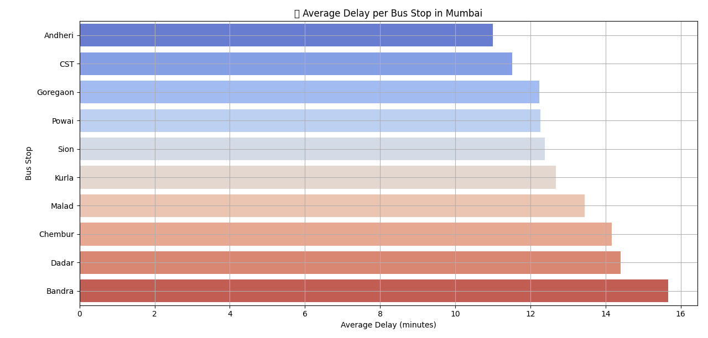
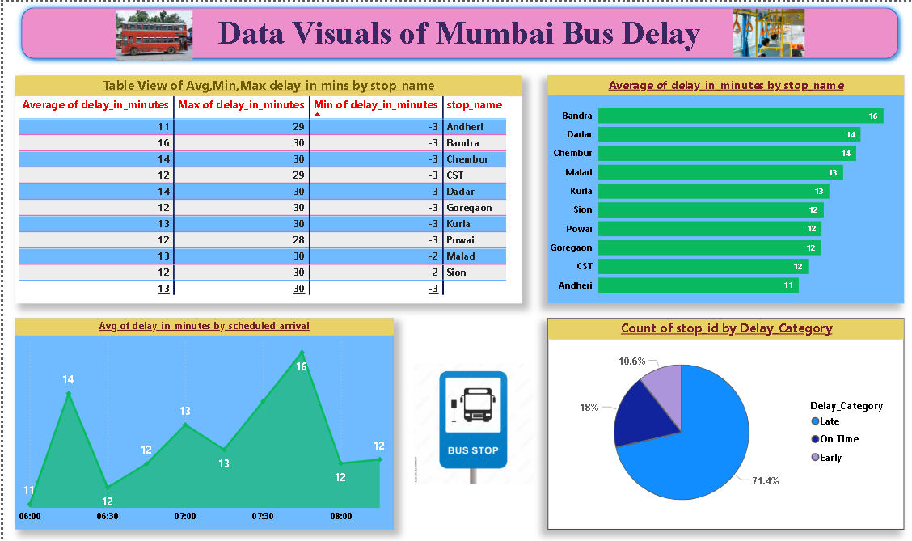

# 🚍 Mumbai Bus Delay Analysis Dashboard

## 📌 Overview
This project analyzes **public transport delays** in Mumbai using **historical GPS data**.  
It includes:
- **Data preprocessing** for cleaning and preparing GPS data.
- **Delay analysis** using Python.
- **Interactive dashboard** using **Streamlit**.
- **Power BI report** for advanced visualization.

---

## 📂 Project Structure
```
Mumbai/
│── app.py                      # Streamlit dashboard app
│── bus_preprocessing.py        # Data cleaning & preprocessing
│── bus_analysis.py              # Analysis & visualization logic
│── mumbai_bus_gps.csv          # Dataset
│── Bus_Delay_Analyis.pbix      # Power BI dashboard file
│── Bus_Delay_Analyis.pbit      # Power BI template file
│── Bus_Delay_Analyis.pdf       # Exported PDF of Power BI dashboard
│── Pictures/                   # Images used in reports & dashboard
```

---

## ⚙️ Requirements

### 1️⃣ Python Libraries
Install the dependencies with:
```bash
pip install -r requirements.txt
```

**requirements.txt**
```
Pillow
matplotlib
pandas
seaborn
streamlit
```

### 2️⃣ Tools
- **Python 3.8+** (for Streamlit dashboard & data processing)
- **Power BI Desktop** (for .pbix dashboard)
- **Excel / CSV viewer** (for dataset inspection)

---

## 🚀 How to Run

### **1. Run the Streamlit Dashboard**
```bash
streamlit run app.py
```
This will open the dashboard in your default browser.

### **2. View Power BI Report**
- Open `Bus_Delay_Analyis.pbix` in **Power BI Desktop**.
- Explore visuals for delay patterns, route performance, and trends.

---

## 📊 Dataset
The dataset `mumbai_bus_gps.csv` contains:
- **vehicle_id** → Unique bus identifier  
- **timestamp** → Date & time of record  
- **latitude**, **longitude** → GPS coordinates  
- **scheduled_arrival**, **actual_arrival** → Time comparison for delay calculation  

---

## 🖼️ Screenshots
| Streamlit Dashboard | Power BI Report |
|--------------------|-----------------|
|  |  |

---

## ✨ Features
- Data preprocessing with `bus_preprocessing.py`
- Visual delay trends by route
- Power BI dashboard with interactive filters
- Streamlit app for quick insights

---

# 🚍 Mumbai Bus Delay Analysis

[](https://sujaltankaria1--mumbai-bus-delay-analysis-using-hist-app-hpbtrn.streamlit.app)


This project analyzes public transport delays in Mumbai using GPS data...


## 📌 Author
Developed for **Public Transport Delay Analysis using Historical GPS Data**.
